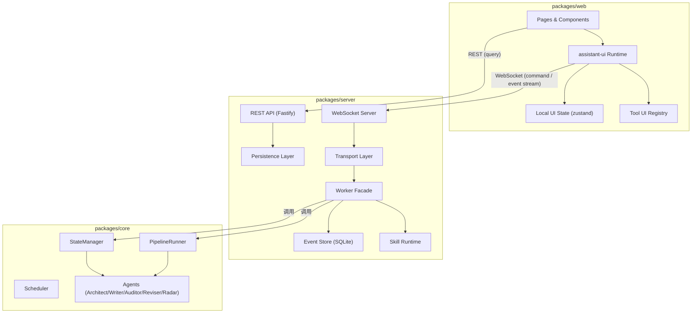
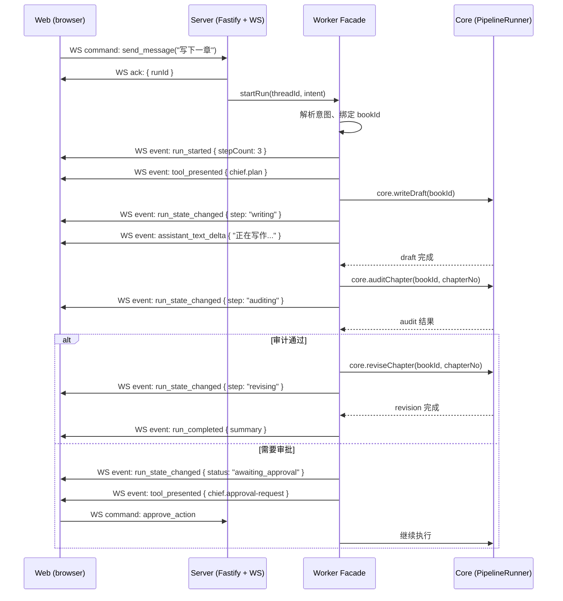

# InkOS 前端设计文档 v3

## 变更日志

| 版本 | 日期 | 变更说明 |
|------|------|----------|
| v3 | 2026-03-16 | 从 v2 全面重构：增加架构图、技术选型、Transport 协议细节、API 示例、数据流图、错误码体系、安全模型、并发模型；消除与需求文档的职责重叠 |
| v2 | — | 初版设计基线 |

## 1. 设计目标与阶段边界

本文档定义 InkOS Web 前端 v3 在当前阶段的最小技术设计基线。

当前阶段是 **设计冻结前阶段**。目标不是把所有未来能力一次性写成硬协议，而是先冻结：

- 最小运行时不变量
- 最小数据模型
- 最小 Transport 契约
- `web → server → core` 的边界
- 原型阶段所需的 Tool UI 状态模型
- 技术选型决议

当前阶段不冻结：

- 完整 settings API
- 全量 skill 管理面
- 全量 materials 类型
- 所有页面的最终布局细节

## 2. 文档治理与阶段顺序

当前对应的 Plane issue：

- `INKOS-2`：前端设计文档持续迭代

阶段顺序是硬约束：

1. 需求文档冻结产品边界（本文档关注"怎么做"，不重复"做什么"）
2. 设计文档冻结最小协议和系统边界
3. HTML 原型验证页面与交互
4. 原型反馈回写文档
5. 再生成开发 issue

文档内容分类：

- `当前冻结`：后续原型和开发都依赖
- `后续演进`：保留方向，但不作为当前实现硬约束

## 3. 系统架构总览

### 3.1 架构图



### 3.2 包边界与技术选型

#### `packages/web`

**技术选型**：React 19 + Next.js (App Router) + assistant-ui + zustand

职责：

- 页面渲染
- `assistant-ui` runtime 与 Tool UI
- 资源查询（REST）
- 本地 UI 状态管理

#### `packages/server`

**技术选型**：Fastify + ws + better-sqlite3

职责：

- 唯一执行入口
- WebSocket 事件流与命令入口
- REST 资源 API
- 线程、run、事件、草案持久化（SQLite）
- Worker Facade
- Skill 解析与快照
- 调用 `@actalk/inkos-core`

选型理由：

| 选项 | 选择 | 理由 |
|------|------|------|
| HTTP Framework | Fastify | 性能好、插件生态成熟、TypeScript 原生支持 |
| Realtime | ws (WebSocket) | 双向通信、browser 原生支持、比 SSE 更适合命令 + 事件双向场景 |
| Storage | better-sqlite3 | 本地单用户、无需外部数据库、嵌入式、同步 API 简单可靠 |
| Schema validation | Zod | 与 core 保持一致 |

#### `packages/core`

职责不变：

- `PipelineRunner`
- `StateManager`
- `Scheduler`
- 现有小说生产能力

### 3.3 强约束：唯一执行入口

- 前端只调用 `packages/server`
- `packages/server` 只调用 `@actalk/inkos-core`
- `packages/server` 不允许 exec CLI
- `packages/core` 不直接承担前端协议职责

## 4. 安全模型

> [!IMPORTANT]
> 即便是本地单用户产品，仍需基本安全保障。

### 4.1 网络安全

- server 默认监听 `127.0.0.1:7749`，不绑定 `0.0.0.0`
- WebSocket 连接验证 `Origin` 头，只接受 localhost
- 不实现登录/认证系统，但保留 API token 占位（`X-InkOS-Token` header），后续可启用

### 4.2 文件安全

- server 不允许访问项目目录外的文件
- 所有文件路径操作必须做路径遍历检查
- `.inkos-ui/` 目录由 server 独占管理

### 4.3 输入验证

- 所有 REST 请求和 WebSocket command 必须经过 Zod schema 验证
- 失败返回 `400` + 标准错误结构

## 5. 当前阶段冻结的最小运行时不变量

当前阶段先冻结以下不变量：

1. `Thread` 是会话容器
2. `Run` 是一次执行容器
3. 所有写操作都通过 WebSocket command 进入 server
4. 所有对话态结果都通过 WebSocket 事件流返回
5. 只读查询通过 REST API
6. 每个可回放结果都必须有稳定的事件记录
7. `server → worker facade → core` 是固定调用链
8. 一个 `runId` 内 skill 快照固定不漂移
9. server 是唯一持久化层，web 不直接写文件

当前阶段不冻结：

- skill 更新/回滚 UI
- 完整 settings 页行为
- 所有未来 Tool UI 类型

## 6. 最小数据模型

### 6.1 `Thread`

```typescript
interface Thread {
  threadId: string            // UUID v7
  scope: 'global' | 'book' | 'chapter' | 'quick'
  title: string
  bookId?: string
  chapterNumber?: number
  lastRunId?: string
  lastMessageAt: string       // ISO 8601
  archived: boolean
  createdAt: string           // ISO 8601
}
```

**查询模式**：

- 按 `scope` 过滤
- 按 `bookId` 过滤
- 按 `lastMessageAt` 倒序排列
- 分页：cursor-based（`after: threadId`）

### 6.2 `SkillRef`

```typescript
interface SkillRef {
  skillId: string
  skillVersion: string        // semver
  skillHash: string           // SHA-256 前 12 位
  source: 'project' | 'user' | 'builtin'
}
```

### 6.3 `Run`

```typescript
interface Run {
  runId: string               // UUID v7
  threadId: string
  status: RunStatus
  startedAt: string           // ISO 8601
  endedAt?: string
  currentStepId?: string
  stepCount?: number          // 计划中的总步骤数
  estimatedDuration?: number  // 预估秒数，用于升级判断
  eventCursor: number         // 单调递增
  pendingApprovalId?: string
  activeCommandId?: string
  lastPersistedAt: string
  skillsLocked: Record<string, SkillRef>
  error?: RunError
}

type RunStatus =
  | 'planning'
  | 'executing'
  | 'awaiting_approval'
  | 'completed'
  | 'failed'
  | 'cancelled'

interface RunError {
  code: string                // 错误码，如 "CORE_TIMEOUT"
  message: string
  stepId?: string             // 失败的步骤
  retryable: boolean
}
```

### 6.4 `ToolPresentation`

```typescript
interface ToolPresentation {
  toolEventId: string         // UUID v7
  runId: string
  toolName: string            // 命名空间格式，如 "chief.plan"
  toolSchemaVersion: string   // semver
  previewPayload: unknown     // 用于回放默认态
  resourceRef?: ResourceRef   // 大文本延迟加载引用
  actions?: ToolAction[]      // 用户可执行的动作
  skillId: string
  skillVersion: string
  upgradeHint?: 'chief'       // 是否需要升级到 /chief
}

interface ResourceRef {
  refId: string
  type: 'text' | 'diff' | 'attachment'
  uri: string                 // REST endpoint
}

interface ToolAction {
  actionId: string
  type: 'apply' | 'regenerate' | 'edit' | 'discard' | 'navigate' | 'retry' | 'approve' | 'reject' | 'submit' | 'cancel'
  label: string               // 按钮文字
  navigateTo?: string         // type == 'navigate' 时的目标路由，如 "/books/:bookId/materials"
  confirmRequired?: boolean   // 是否需要二次确认
  riskLevel?: 'low' | 'medium' | 'high'
}
```

> [!NOTE]
> `actions` 由 server 显式声明，web 不允许根据 `toolName` 或 assistant 文本做硬编码行为推断。
> `submit` 用于表单提交；`cancel` 用于表单取消、审批取消或运行取消等“主动终止当前动作”的统一入口，具体命令由 `actionId` 绑定。

### 6.5 `DraftArtifact`

```typescript
interface DraftArtifact {
  draftId: string             // UUID v7
  type: string                // material type, e.g. "character"
  bookId: string
  status: 'draft' | 'applied' | 'discarded' | 'failed'
  revision: number            // 乐观锁版本号，从 1 开始
  parentDraftId?: string
  sourceThreadId: string
  sourceRunId: string
  skillRef: SkillRef
  toolSchemaVersion: string
  preview: unknown            // 结构化预览数据
  artifactSnapshotRefs: string[]  // 快照引用 ID 列表
  etag: string                // HTTP ETag，用于冲突检测
  createdAt: string           // ISO 8601
  updatedAt: string
}
```

**冲突处理**：

- `apply_draft` / `edit_draft` 必须携带 `etag`
- 如果 `etag` 不匹配，server 返回 `409 Conflict` + 最新版本
- web 展示冲突提示，用户选择：覆盖 / 放弃 / 查看最新

## 7. Worker Facade 与 Core Integration

### 7.1 Worker Facade 的职责

`packages/server` 内必须存在一层 facade / orchestrator，用于：

- 把总编计划拆成 step
- 为每个 step 绑定 skill
- 把 core 调用包装成可追踪事件
- 负责审批挂起、取消、失败归因、结果汇总

### 7.2 为什么必须有这一层

没有 facade 就无法稳定实现：

- `worker_trace`
- `ToolPresentation`
- 审批挂起
- 取消与重试
- 回放一致性

### 7.3 并发模型

> [!IMPORTANT]
> 当前阶段冻结以下并发约束。

| 约束 | 规则 |
|------|------|
| 同一 Thread 并发 Run | **不允许** — 同一 Thread 同时只能有一个 active Run |
| 不同 Thread 并发 Run | **允许** — 但共享同一 core 实例，需要排队 |
| 同一 Book 并发写操作 | **不允许** — 复用 core 已有的文件锁机制 |
| Run 内 Step 并行 | **当前不支持** — 所有 step 串行执行 |
| Run 取消 | **允许** — 通过 `cancel_run` 命令，facade 负责清理 |

### 7.4 与 core 的关系

- `core` 保持生产能力内核
- `server` 负责前端协议与 orchestration
- facade 既不是前端，也不是 core，而是 server 的执行桥接层

### 7.5 Skill 与现有 Agent 的映射

| Skill ID | 对应 Core Agent | 说明 |
|----------|-----------------|------|
| `chief.architect` | `ArchitectAgent` | 章节规划 |
| `chief.writer` | `WriterAgent` | 正文生成 |
| `chief.auditor` | `ContinuityAuditor` | 连续性审计 |
| `chief.reviser` | `ReviserAgent` | 修订 |
| `chief.radar` | `RadarAgent` | 市场扫描 |
| `chief.analyzer` | `ChapterAnalyzerAgent` | 章节分析 |
| `material.generator` | — (新增) | 素材生成（调用 LLM） |

## 8. Transport 协议

### 8.1 协议分层

| 层 | 协议 | 用途 |
|----|------|------|
| Transport | WebSocket (`ws://localhost:7749/ws`) | 聊天、命令、事件流 |
| REST | HTTP (`http://localhost:7749/api/v1`) | 列表、详情、只读资源查询 |

### 8.2 WebSocket 消息格式

所有 WebSocket 消息使用 JSON 格式：

**Client → Server（Command）**：

```json
{
  "type": "command",
  "commandId": "cmd_01J...",
  "command": "send_message",
  "payload": {
    "threadId": "thr_01J...",
    "content": "帮我写下一章"
  }
}
```

**Server → Client（Event）**：

```json
{
  "type": "event",
  "eventId": "evt_01J...",
  "event": "assistant_text_delta",
  "runId": "run_01J...",
  "payload": {
    "delta": "好的，我来",
    "cursor": 42
  }
}
```

**Server → Client（Ack）**：

```json
{
  "type": "ack",
  "commandId": "cmd_01J...",
  "success": true,
  "runId": "run_01J..."
}
```

**Server → Client（Error）**：

```json
{
  "type": "error",
  "commandId": "cmd_01J...",
  "error": {
    "code": "INVALID_COMMAND",
    "message": "threadId is required",
    "details": {}
  }
}
```

### 8.3 当前阶段冻结的 Command

| Command | 说明 | Payload 关键字段 |
|---------|------|-----------------|
| `send_message` | 发送用户消息 | `threadId, content` |
| `submit_form` | 提交表单 | `threadId, runId, toolEventId, formData` |
| `approve_action` | 批准操作 | `threadId, runId, approvalId` |
| `cancel_action` | 取消审批 | `threadId, runId, approvalId` |
| `apply_draft` | 应用草案 | `draftId, revision, etag` |
| `regenerate_draft` | 重新生成 | `draftId, instruction?` |
| `edit_draft` | 编辑草案 | `draftId, revision, etag, changes` |
| `discard_draft` | 丢弃草案 | `draftId` |
| `cancel_run` | 取消执行 | `runId` |

### 8.4 当前阶段冻结的事件

| Event | 说明 | Payload 关键字段 |
|-------|------|-----------------|
| `run_started` | 执行开始 | `runId, threadId, stepCount?, estimatedDuration?` |
| `run_state_changed` | 状态变化 | `runId, status, currentStepId?` |
| `assistant_text_delta` | 文本流 | `delta, cursor` |
| `tool_presented` | Tool UI 呈现 | `ToolPresentation` 完整结构 |
| `draft_state_changed` | 草案状态变化 | `draftId, revision, status, sourceRunId` |
| `run_completed` | 执行完成 | `runId, summary?` |
| `run_failed` | 执行失败 | `runId, error: RunError` |
| `run_cancelled` | 执行取消 | `runId` |

补充约束：

- `apply_draft / regenerate_draft / edit_draft / discard_draft` 改变草案事实状态后，server 必须发出 `draft_state_changed`
- `draft_state_changed` 至少要能标识 `draftId / revision / status / sourceRunId`
- 所有事件都包含 `eventId` 和单调递增的 `cursor`

### 8.5 幂等

所有 command 必须带 `commandId`。

server 必须保证：

- 相同 `commandId` 只执行一次
- 重复提交返回同一 ack 结果
- `apply_draft` 对同一 `draftId + revision` 幂等
- server 保留 `commandId` 去重窗口至少 5 分钟

### 8.6 心跳与重连

- server 每 30 秒发送 `ping` frame
- client 收到 `ping` 后立即回复 `pong`
- client 60 秒未收到任何消息则判定断连，触发重连
- 重连后 client 发送 `resume` command，携带最后收到的 `cursor`
- server 从 cursor 之后重放未确认事件

```json
{
  "type": "command",
  "commandId": "cmd_01J...",
  "command": "resume",
  "payload": {
    "lastCursor": 42
  }
}
```

## 9. REST API

### 9.1 通用约定

- 基础路径：`/api/v1`
- 分页：cursor-based（`?after=<id>&limit=20`）
- 排序：默认按创建时间倒序
- 响应格式：JSON
- 错误格式：标准错误结构（见 §11）

### 9.2 当前阶段冻结的 Endpoints

| Method | Path | 说明 |
|--------|------|------|
| GET | `/api/v1/threads` | 线程列表（支持 `?scope=&bookId=`） |
| GET | `/api/v1/threads/:threadId` | 线程详情 |
| GET | `/api/v1/threads/:threadId/messages` | 消息列表 |
| GET | `/api/v1/runs/:runId` | Run 详情 |
| GET | `/api/v1/runs/:runId/events` | Run 事件列表 |
| GET | `/api/v1/books` | 书籍列表 |
| GET | `/api/v1/books/:bookId` | 书籍详情 |
| GET | `/api/v1/books/:bookId/chapters` | 章节列表 |
| GET | `/api/v1/books/:bookId/chapters/:chapterNo` | 章节详情（含正文） |
| GET | `/api/v1/books/:bookId/truth` | Truth files 列表 |
| GET | `/api/v1/books/:bookId/truth/:fileName` | Truth file 内容 |
| GET | `/api/v1/books/:bookId/materials` | Materials 列表 |
| GET | `/api/v1/books/:bookId/materials/:materialId` | Material 详情 |
| GET | `/api/v1/drafts/:draftId` | 草案详情 |
| GET | `/api/v1/resources/:refId` | 资源内容（大文本延迟加载） |

### 9.3 API 示例

**请求**：

```http
GET /api/v1/books/book_01J.../chapters?after=ch_01J...&limit=10
Accept: application/json
```

**响应（200）**：

```json
{
  "data": [
    {
      "chapterNumber": 12,
      "title": "第十二章",
      "status": "approved",
      "wordCount": 14200,
      "auditStatus": "passed",
      "createdAt": "2026-03-15T10:30:00+08:00",
      "updatedAt": "2026-03-15T11:00:00+08:00"
    }
  ],
  "pagination": {
    "hasMore": true,
    "nextCursor": "ch_01J..."
  }
}
```

## 10. Replay / Resume / Event Store

### 10.1 存储引擎

Event Store 使用 SQLite（与 server 共用同一 db 文件 `.inkos-ui/inkos.db`）。

核心表结构：

```sql
CREATE TABLE events (
  event_id TEXT PRIMARY KEY,
  run_id TEXT NOT NULL,
  thread_id TEXT NOT NULL,
  event_type TEXT NOT NULL,
  cursor INTEGER NOT NULL,
  payload TEXT NOT NULL,      -- JSON
  created_at TEXT NOT NULL,   -- ISO 8601
  UNIQUE(run_id, cursor)
);

CREATE INDEX idx_events_run ON events(run_id, cursor);
CREATE INDEX idx_events_thread ON events(thread_id, cursor);
```

### 10.2 当前阶段的回放承诺

当前阶段只承诺：

- 线程刷新后可恢复最近执行状态
- 已记录的 `ToolPresentation` 可回放默认态
- 历史结果查看不需要重新执行 skill

### 10.3 前提

为实现以上承诺，server 必须持久化：

- Run 元数据
- 事件日志
- artifact snapshot 引用

### 10.4 当前阶段不承诺

- 所有长文本都永久内嵌在事件中（超过 10KB 使用 ResourceRef）
- 所有旧资源都不依赖额外 snapshot
- 所有未来 schema 版本都自动兼容

## 11. 错误码体系

### 11.1 标准错误结构

```typescript
interface InkOSError {
  code: string          // 命名空间.错误名，如 "TRANSPORT.INVALID_COMMAND"
  message: string       // 人可读的中文/英文描述
  details?: unknown     // 附加信息
}
```

### 11.2 错误码前缀命名空间

| 前缀 | 范围 |
|------|------|
| `TRANSPORT.*` | WebSocket 协议层错误 |
| `COMMAND.*` | 命令处理错误 |
| `RUN.*` | 执行相关错误 |
| `DRAFT.*` | 草案操作错误 |
| `CORE.*` | core 调用错误 |
| `IO.*` | 文件/存储 I/O 错误 |

### 11.3 常见错误码

| 错误码 | HTTP Status | 说明 |
|--------|-------------|------|
| `TRANSPORT.INVALID_MESSAGE` | — (WS) | WebSocket 消息格式错误 |
| `COMMAND.DUPLICATE` | — (WS) | commandId 重复 |
| `COMMAND.INVALID_PAYLOAD` | 400 | 命令参数校验失败 |
| `RUN.NOT_FOUND` | 404 | Run 不存在 |
| `RUN.ALREADY_ACTIVE` | 409 | Thread 已有活跃 Run |
| `DRAFT.CONFLICT` | 409 | etag 不匹配 |
| `DRAFT.NOT_FOUND` | 404 | 草案不存在 |
| `CORE.TIMEOUT` | 504 | core 调用超时 |
| `CORE.BOOK_LOCKED` | 423 | 书籍写锁被占用 |
| `IO.STORAGE_FULL` | 507 | 存储空间不足 |

## 12. Skill Runtime Contract

### 12.1 目标

skill 是 server 侧内部运行时能力包，不是前端主交互概念。

### 12.2 当前阶段冻结

- 每个关键 worker 必须绑定一个且仅一个 skill
- `runId` 内 skill 快照固定
- `skillHash` 用于复盘标识
- skill 只能声明兼容，不直接控制前端 schema

### 12.3 当前阶段延后

以下内容延后到 v3.1 或开发细化阶段：

- 完整 settings/skills UI
- skill 更新/回滚/pin 流程
- Stable / Experimental 的最终产品面
- 项目级与用户级 override 的完整交互

### 12.4 `skill.json`

当前阶段只保留方向性约束：

```json
{
  "id": "chief.writer",
  "version": "1.0.0",
  "description": "正文生成能力",
  "compatibleToolSchemaVersions": ["1.x"],
  "agentClass": "WriterAgent"
}
```

- 存在 `skill.json`
- 记录 `id / version / description / compatibleToolSchemaVersions`
- server 启动时校验

不在当前阶段把完整 skill 包目录与所有字段写成不可变硬契约。

## 13. Tool UI Registry 与状态模型

### 13.1 稳定命名空间

`toolName` 维持产品级稳定命名：

- `chief.*` — 总编核心能力
- `material.*` — 素材相关
- `chapter.*` — 章节相关
- `scheduler.*` — 调度相关

### 13.2 当前阶段最小 Tool UI 集合

| toolName | 用途 | 对应场景 |
|----------|------|----------|
| `chief.plan` | 执行计划展示 | A, B |
| `chief.worker-trace` | 执行进度条 | B |
| `material.request-form` | 素材参数表单 | C |
| `material.table-result` | 素材结果卡片 | C |
| `chief.approval-request` | 审批请求卡 | B, D |
| `chapter.audit-report` | 审计报告摘要 | D |
| `chief.error-card` | 错误/失败卡片 | A, C |

### 13.3 Tool UI 状态语义

当前阶段先冻结 UX 状态：

| 状态 | 含义 | 来源 |
|------|------|------|
| `idle` | 初始/默认态 | 初始 |
| `submitting` | 正在提交 | web 短暂态 |
| `generating` | 正在生成 | server event 驱动 |
| `awaiting_user_action` | 等待用户决策 | server event 驱动 |
| `applied` | 已应用 | 从 DraftArtifact.status 推导 |
| `discarded` | 已丢弃 | 从 DraftArtifact.status 推导 |
| `failed` | 已失败 | 从 DraftArtifact.status 或 Run.error 推导 |
| `completed` | 已完成且只读 | 从 Run.status 推导 |
| `cancelled` | 已取消且只读 | 从 Run.status 推导 |

状态推导约束：

- `awaiting_user_action` 表示当前卡片存在待用户决策的显式 action，不要求与 `Run.status` 一一等价
- `applied / discarded / failed` 优先从绑定的 `DraftArtifact.status` 推导
- `completed / cancelled` 允许作为只读终态展示，但不可再触发写动作
- web 只允许主动维护 `submitting / generating` 这类短暂交互中间态，不允许长期复制服务端事实状态

### 13.4 Schema Ownership

- `toolSchemaVersion` 由 server 维护
- web 只消费版本
- skill 只能声明兼容范围，不能自行决定前端 schema 版本

## 14. assistant-ui 交互模型

### 14.1 当前阶段重点

当前阶段只需要设计清楚：

- `Thread` runtime 集成
- Tool UI 容器
- `AssistantModal`（快速弹层）
- modal 升级到 `/chief` 的规则

### 14.2 `/chief` 最小闭环

原型和后续实现只先验证：

- 主线程
- 表单卡
- 结果卡
- 审批卡
- 页面跳转

以下能力延后：

- 完整线程分组策略
- 右侧工件检查器细化
- skill 快照展示细节

## 15. 数据流示例

### 15.1 场景 B 完整数据流：继续写下一章



## 16. Materials Bridge Strategy

### 16.1 当前阶段冻结

- 首批 types：`character / faction / location`
- `materials_summary.md` 作为 bridge strategy
- server 在调用 core 前注入 materials 摘要

### 16.2 说明

`materials_summary.md` 是当前阶段的桥接方案，不代表长期终态架构。

## 17. 本地持久化与唯一事实源

当前阶段写死：

- server 负责持久化 `Thread / Run / Event / DraftArtifact`
- `.inkos-ui/inkos.db`（SQLite）是持久化文件
- web 通过 API 读取，不直接写文件
- `.inkos-ui/` 目录在项目根目录下

## 18. 统一样式系统设计基线

当前阶段先冻结这些设计基线：

- light / dark 双主题 token（CSS custom properties）
- 页面栅格（12 列）
- 内容最大宽度（720px 阅读区 / 1200px 工作台区）
- 聊天卡片与业务卡片的关系
- 按钮等级：`--btn-primary` / `--btn-secondary` / `--btn-danger` / `--btn-ghost`
- 表格密度
- 卡片层级与留白

主题系统要求：

- light 和 dark 共用同一套语义 token 命名
- 不允许为 dark 主题单独发明一套组件层级
- 原型阶段至少验证 `/chief` 的 light/dark 切换
- 后续页面优先复用 token，不允许页面内私有硬编码色板

当前阶段不冻结：

- 所有最终像素级尺寸
- `/chief` 三栏比例
- 工件检查器是否常驻

## 19. 当前阶段延后项

以下内容明确延后：

- 完整 settings/skills API
- Stable / Experimental 完整交互
- 全量 materials 类型
- 高级 modal 细则
- `/truth`、`/automation`、`/settings` 的最终布局
- 多语言支持
- 插件系统

## 20. 技术验证矩阵

当前阶段至少需要验证：

| 验证项 | 验证方式 | 通过标准 |
|--------|----------|----------|
| `commandId` 幂等 | 单元测试 + 集成测试 | 重复提交返回同一结果 |
| 事件流完整 | 集成测试 | `run_started → tool_presented → run_completed/failed/cancelled` |
| Run 恢复 | 集成测试 | 断连重连后恢复进行中 Run 视图 |
| DraftArtifact revision | 单元测试 | etag 冲突正确返回 409 |
| Facade step 追踪 | 集成测试 | core 调用包装成独立 step 事件 |
| Skill 快照不漂移 | 单元测试 | 一个 run 内 skillHash 固定 |
| WebSocket 重连 | E2E 测试 | 断连 → 重连 → resume 从 cursor 恢复 |
| SQLite 持久化 | 集成测试 | 重启后数据完整 |
