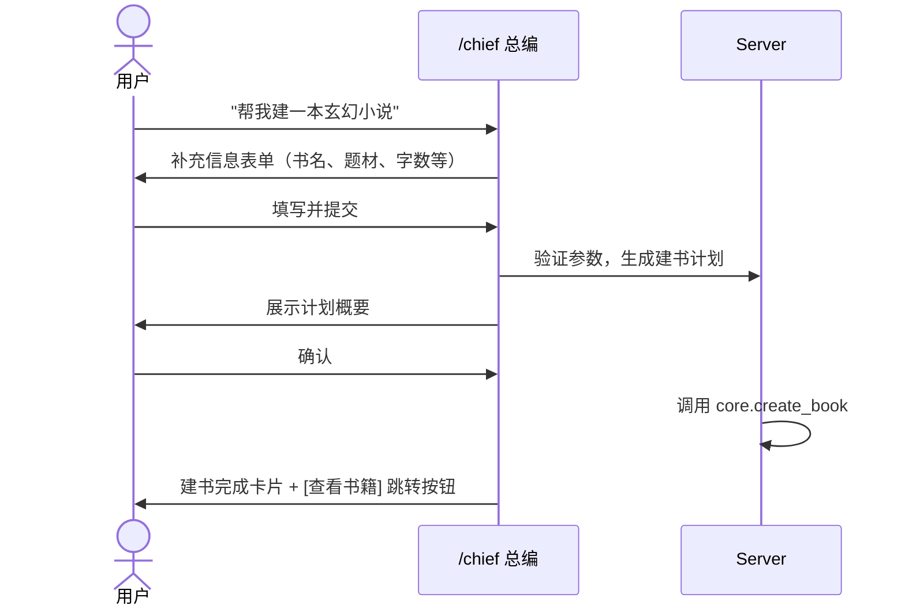
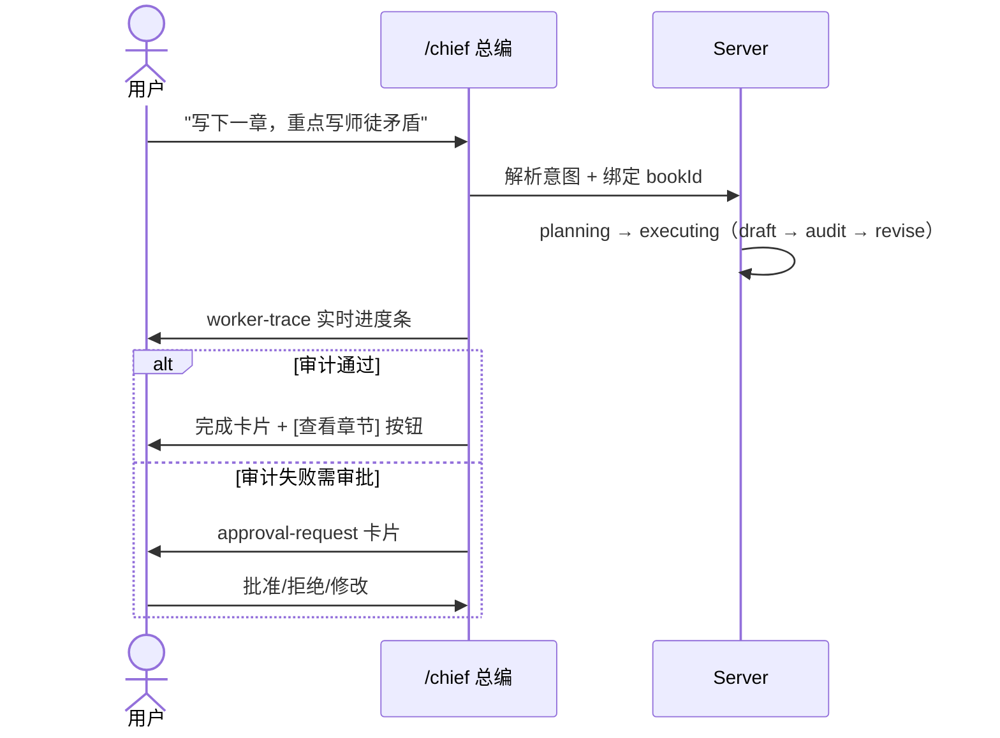
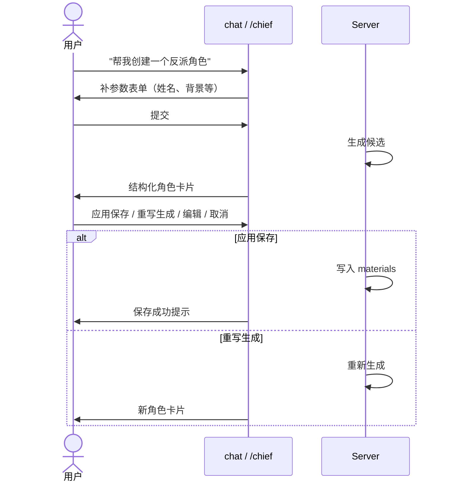
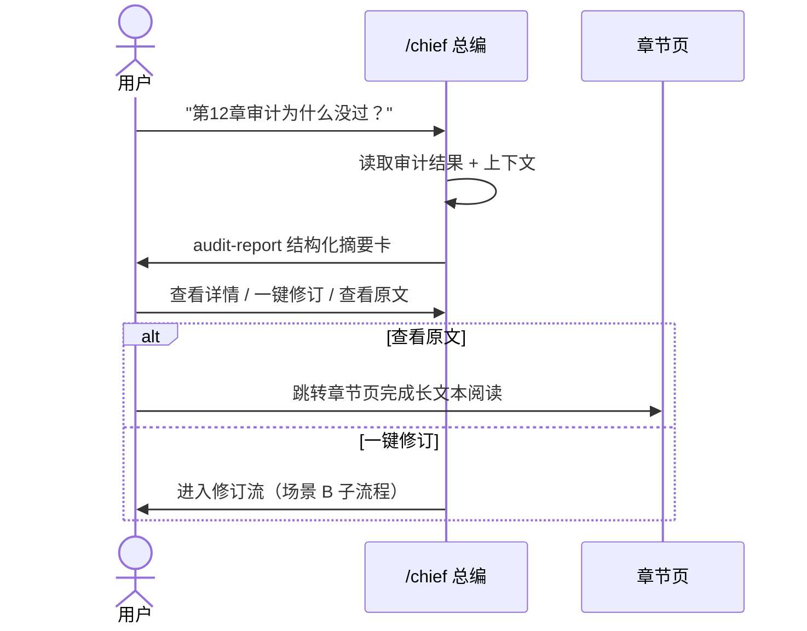

# InkOS 前端需求文档 v3

## 变更日志

| 版本 | 日期 | 变更说明 |
|------|------|----------|
| v3 | 2026-03-16 | 从 v2 全面重构：增加术语表、异常流、响应式策略、非功能性需求、用户旅程图；消除与设计文档的职责重叠；重新组织章节结构 |
| v2 | — | 初版需求基线 |

## 1. 文档目标与阶段边界

本文档定义 InkOS Web 前端 v3 在当前阶段的产品需求基线。

当前阶段是 **文档冻结前阶段**。目标是先把需求边界、关键场景、完成面职责和原型验证范围收敛清楚，再进入 HTML 原型验证，最后才进入开发拆解。

### 1.1 当前阶段唯一目标

- 收敛需求文档
- 收敛设计文档
- 为后续原型验证和开发拆解提供稳定基线

### 1.2 当前阶段不做

- 不直接进入正式前端实现
- 不提前批量拆开发 issue
- 不把 HTML 原型当成正式实现代码
- 不把 Plane Pages 当作唯一文档源

### 1.3 进入下一阶段的条件

1. 本文档的核心场景、页面职责、风险边界、交互承载矩阵已稳定
2. 设计文档已冻结最小运行时协议和系统边界
3. 才允许进入 HTML 原型验证阶段

## 2. 术语表

> [!IMPORTANT]
> 以下术语在全部文档中必须统一使用。

| 术语 | 定义 |
|------|------|
| **总编（Chief Editor）** | 系统的唯一对用户 AI 角色，所有用户交互都通过总编完成 |
| **`/chief`** | 总编工作台页面，承载主线程交互和多步事务 |
| **Thread（线程）** | 一次会话容器，绑定特定 scope（global / book / chapter / quick） |
| **Run（执行）** | 一次任务执行容器，从 planning 到 completed 或 failed |
| **Skill** | server 侧的内部运行时能力包。对普通用户不可见，对高级用户可在设置中查看 |
| **Materials（素材）** | 用户可管理的创作素材，如角色、阵营、地点 |
| **Truth Files（真相文件）** | 系统维护的 7 个事实文件（current_state.md 等），是单一事实源 |
| **Tool UI** | 在聊天流中嵌入的结构化交互卡片（表单、结果、审批等） |
| **DraftArtifact（草案）** | 生成但未确认的产出物，有 draft / applied / discarded / failed 四种状态 |
| **Modal（快速弹层）** | 页面右下角的快速交互入口，仅适合轻量操作 |
| **Worker** | 底层 Agent 类的执行单元（ArchitectAgent、WriterAgent 等） |
| **完成面** | 一个场景最终在哪个交互界面闭环 |

## 3. 文档治理与 Plane 协作方式

当前对应的 Plane issue：

- `INKOS-1`：前端需求文档持续迭代

协作规则：

- 仓库中的 `docs/v3/frontend-requirements-v3.md` 是唯一事实源
- Plane issue 与 workpad 用于跟踪变化、记录争议点和当前阶段结论
- 文档阶段完成前，不生成正式开发 issue
- HTML 原型只用于验证本文档，不替代本文档

本文档进入 `Review` 的条件：

- 核心用户场景已收敛
- chat / `/chief` / 专页的职责边界已明确
- 总编 Agent 的自动化边界与人工确认边界已明确
- v3 首批范围与延后范围已明确

本文档进入 `Done` 的条件：

- 已通过设计文档对齐
- 已通过首轮原型验证
- 原型反馈已回写本文档

## 4. 产品定位与非目标

InkOS Web 是一个 **本机单用户小说生产控制台**。

### 4.1 产品定位

- 以总编 Agent 作为唯一直接面向用户的 AI 角色
- 把建书、写作、审计、修订、导入、调度、素材生成收敛为统一工作流
- 让用户在聊天页完成大多数基础任务，而不是在终端、文档和多个后台页面之间切换
- 让所有自动执行都可见、可取消、可追踪、可复盘

### 4.2 非目标

- 不做多人协作
- 不做登录系统
- 不做公网 SaaS
- 不直接调用 CLI 二进制执行任务
- 不要求移动端等价承载全部生产操作（移动端策略见 §12）
- 不把内部运行时 skill 暴露为普通用户必须理解的主概念

## 5. 当前系统能力基线

### 5.1 现有核心能力（`packages/core`）

可复用的底层 Agent 类：

- `ArchitectAgent`
- `WriterAgent`
- `ContinuityAuditor`
- `ReviserAgent`
- `RadarAgent`
- `ChapterAnalyzerAgent`

自然语言 agent loop 已有 13 个可调用工具能力：

- `write_draft` / `audit_chapter` / `revise_chapter`
- `scan_market` / `create_book` / `get_book_status`
- `read_truth_files` / `list_books` / `write_full_pipeline`
- `web_fetch` / `import_style` / `import_canon` / `import_chapters`

### 5.2 v3 前端阶段分层

- **现有核心能力层**：继续复用 `packages/core`
- **新增服务层**：由 `packages/server` 补齐（前端协议、持久化、orchestration）
- **新增前端层**：由 `packages/web` 补齐（UI、assistant runtime、Tool UI）

## 6. 用户角色与 UI 映射

### 6.1 独立作者（Primary）

最重要的任务：

- 新建一本书
- 继续写下一章
- 审计失败后快速理解问题
- 生成角色等素材并保存

UI 策略：
- 默认视图，所有核心交互可见
- 隐藏 skill 管理和高级调度配置
- 简化的设置面板

### 6.2 多书运营者（Secondary）

最重要的任务：

- 看多本书进度与风险
- 看当前自动化状态
- 快速切换上下文

UI 策略：
- 仪表盘优先展示多书概览和进度
- 支持快速书籍切换
- 调度中心入口突出

### 6.3 深度调优用户（Power User）

最重要的任务：

- 调整文风与导入资料
- 查看 materials 是否进入写作上下文
- 在高级设置中查看内部能力状态

UI 策略：
- 设置页增加"高级"分区
- Skill 状态面板可开启
- 可查看详细的执行日志和事件流

## 7. v3 首批必须闭环的 4 个场景

当前阶段先把以下 4 个场景写死，其他场景属于兼容后续扩展。

### 7.1 场景 A：建书

**用户目标**：从无到有建立一本书的基础配置。

**正常流（Happy Path）**：

**异常处理**：

| 异常情况 | 处理方式 |
|----------|----------|
| 必填字段缺失 | 表单标红 + 内联提示，不允许提交 |
| 书名重复 | 总编提示冲突，建议修改 |
| core 调用失败 | 展示 `run_failed` 卡片，附带错误摘要和重试按钮 |
| 网络中断 | 展示离线提示（见 §13），恢复后自动重试 |

### 7.2 场景 B：继续写下一章

**用户目标**：在当前书上下文中推进下一章。

**正常流**：

**异常处理**：

| 异常情况 | 处理方式 |
|----------|----------|
| 上下文不足（无书） | 总编引导先建书或选择书籍 |
| 执行超时（> 5min） | 展示超时提示 + 可取消 |
| 部分 step 失败 | 展示失败步骤详情 + 跳过/重试选项 |
| 审计连续失败 | 总编建议人工介入，暂停自动重试 |

### 7.3 场景 C：生成角色并保存

**用户目标**：通过对话生成角色候选并保存到素材库。

**正常流**：

**异常处理**：

| 异常情况 | 处理方式 |
|----------|----------|
| 生成失败 | 展示 failed 卡片 + 重试按钮 |
| 保存冲突（同名角色） | 提示冲突 + 覆盖确认 |
| 生成超时 | 超时提示 + 取消/等待选项 |

### 7.4 场景 D：诊断审计失败

**用户目标**：理解某章为什么没通过审计，并得到下一步建议。

**正常流**：

**异常处理**：

| 异常情况 | 处理方式 |
|----------|----------|
| 审计记录不存在 | 总编提示先执行审计 |
| 章节已被重写 | 提示审计结果可能过期，建议重新审计 |

## 8. 交互承载矩阵

这是 v3 的核心产品约束。

### 8.0 场景与完成面映射

| 场景 | 默认完成面 | 说明 |
|------|----------|------|
| A：建书 | `/chief` | 多步补信息与建书结果确认 |
| B：继续写下一章 | `/chief` | 计划、执行轨迹与结果都在主工作台完成 |
| C：生成角色并保存 | chat 内闭环，必要时升级到 `/chief` | 会话界面默认完成；复杂候选比较时升级 |
| D：诊断审计失败 | `/chief`，必要时跳章节页 | 结构化说明在 `/chief`；长文本阅读在章节页 |

### 8.1 chat 内闭环范围

必须能在聊天内完成：

- 参数补充（单步表单）
- 计划展示
- 单个 material 生成与确认
- 结果确认与保存
- 轻量诊断说明

"chat 内闭环"指 **会话界面中的单步事务闭环**。

### 8.2 `/chief` 完成范围

必须在 `/chief` 完成：

- 多步事务（超过 1 次工具调用）
- 审批动作
- 生成候选的比较与确认
- 预计执行超过 30 秒的任务
- 需要持续跟踪的线程

### 8.3 专页完成范围

必须在专页完成：

- 大文本阅读（章节正文）
- 长 diff 浏览
- truth files 浏览
- materials 列表管理
- 调度监控

### 8.4 modal（快速弹层）升级规则

Modal 只适合承载：

- 快速问答
- 页面内轻量查询
- 单步轻操作

**以下任一条件触发时必须升级到 `/chief`**：

| 触发条件 | 判断方 | 说明 |
|----------|--------|------|
| 需要审批 | server（通过 `awaiting_approval` 状态） | server 发出审批事件时自动升级 |
| 需要展示复杂结构化对比 | server（通过 `ToolPresentation.actions` 数量） | 多于 2 个 action 时升级 |
| 工具调用超过 1 次 | server（通过 run 的 step 数量） | server 在 `run_started` 中声明 stepCount > 1 时升级 |
| 预计执行超过 30 秒 | server（通过 run 预估时长） | server 声明 estimatedDuration > 30s 时升级 |
| 需要跨页面上下文 | server（通过 scope 声明） | thread scope 非 quick 时升级 |

> [!NOTE]
> 升级判断由 server 侧驱动，web 端不自行推断。server 在事件中携带 `upgradeHint` 字段。

补充说明：

- 轻量的单卡结构化结果允许留在 chat 或快速 modal 内完成，只要仍是单步事务
- 涉及跳转到书籍页、章节页、修订流的场景，界面必须提供明确可点击入口，不能只靠 assistant 文本暗示

## 9. 总编 Agent 的产品职责与边界

### 9.1 产品职责

总编 Agent 是系统的统一调度者。

职责：

- 理解用户目标
- 绑定当前上下文（书籍、章节）
- 决定是否缺参数
- 制定计划
- 调度底层能力（worker）
- 汇总结果
- 引导用户完成决策

### 9.2 用户可感知能力

用户看到的是：

- 总编会提问补信息
- 总编会展示计划
- 总编会解释系统做了什么
- 总编会要求确认高风险操作
- 总编会输出结构化结果
- 总编会在失败时提供诊断和下一步建议

### 9.3 内部能力

系统内部会发生：

- worker 路由
- skill 解析
- core 调用
- 事件记录
- materials 写入

这些不作为普通用户主交互的一部分暴露。

### 9.4 自动执行边界

**默认可自动执行（low risk，不审批）**：

- 只读分析
- 轻量查询
- 生成草案
- 可撤销的 materials 草案保存

**必须暂停并等待用户（high risk，审批）**：

- 章节重写
- 回滚快照
- 导入覆盖
- 修改全局模型或调度配置

**必须只分析不执行（上下文不足）**：

- 用户意图不明确
- 当前上下文不足以安全写入
- 预计会改变大量项目事实但用户未确认

### 9.5 拒绝与升级条件

总编必须拒绝或转人工的情况：

- skill 缺失且无安全降级路径
- 当前动作会破坏项目事实但用户未确认
- 依赖信息缺失且无法合理推断
- 连续失败超过 3 次

## 10. 风险分级与审批规则

### 10.1 风险等级定义

| 等级 | 定义 | 可逆性 |
|------|------|--------|
| `low` | 只读分析、生成草案、不改写项目事实 | N/A |
| `medium` | 写入可撤销内容（materials、章节摘要、book_rules 修改） | 可撤销 |
| `high` | 改写章节正文、truth files、导入覆盖历史、修改全局策略 | 不可逆或影响大 |

### 10.2 审批矩阵

| 动作 | 风险 | 是否审批 |
|------|------|----------|
| 读取状态 / 分析问题 | low | 不审批 |
| 生成素材草案 | low | 不审批 |
| 保存素材到 materials | medium | 不走 Agent 审批，但必须可撤销 |
| 修改 book_rules.md | medium | 不走 Agent 审批，但展示 diff 确认 |
| 更新章节摘要 | medium | 不走 Agent 审批，但必须可撤销 |
| 丢弃未应用草案 | low | 需要 UI 二次确认 |
| 重写章节 | high | 必须审批 |
| 回滚快照 | high | 必须审批 |
| 导入章节并覆盖索引 | high | 必须审批 |
| 修改全局模型或调度配置 | high | 必须审批 |

## 11. 信息架构与首版页面范围

### 11.1 一级页面与职责

| 路由 | 页面名称 | 核心职责 |
|------|----------|----------|
| `/` | 仪表盘 | 多书进度总览、待办事项、最近活动、快速入口 |
| `/chief` | 总编工作台 | 主线程交互、多步事务、审批、执行轨迹 |
| `/books` | 书籍列表 | 所有书籍的列表、状态、快速操作 |
| `/books/:bookId` | 书籍总览 | 单书章节列表、进度、truth files 入口、materials 入口 |
| `/books/:bookId/chapters/:chapterNo` | 章节工作台 | 章节正文阅读、审计报告详情、修订 diff |
| `/books/:bookId/truth` | Truth Files 中心 | 7 个真相文件的浏览和编辑 |
| `/books/:bookId/materials` | 素材中心 | materials 列表管理、来源追踪、状态查看 |
| `/automation` | 调度中心 | 守护进程状态、调度队列、执行历史 |
| `/settings` | 设置中心 | LLM 配置、通知、高级选项（含 Skill 管理） |

### 11.2 首版优先级分层

**当前阶段优先收敛（需要完整闭环）**：

- `/chief` — 核心交互面
- `/books/:bookId/materials` — 素材管理
- `/books/:bookId/chapters/:chapterNo` — 章节分析完成面
- `/` — 仪表盘核心指标

**当前阶段定义职责、不做完整细节**：

- `/books/:bookId/truth` — truth files 浏览
- `/automation` — 调度监控
- `/settings` — 设置（除 LLM 基本配置外）

## 12. 响应式与移动端策略

### 12.1 分级策略

| 屏幕尺寸 | 断点 | 承载能力 |
|----------|------|----------|
| Desktop | ≥ 1280px | 全功能，多栏布局 |
| Tablet | 768px – 1279px | 主要功能，折叠侧边栏 |
| Mobile | < 768px | 只读 + 轻交互 |

### 12.2 移动端可以做什么

- 查看书籍列表和进度
- 查看章节正文
- 查看通知和待办
- 发起简单对话（快速问答）

### 12.3 移动端不支持

- 完整的 `/chief` 多步事务
- 长表单填写
- Materials 批量管理
- 调度配置

> [!NOTE]
> 移动端作为只读监控 + 轻量交互端，主要生产操作仍在 Desktop 完成。

## 13. 离线与连接状态处理

### 13.1 连接状态定义

| 状态 | 含义 | 前端行为 |
|------|------|----------|
| `connected` | server 正常运行且连接稳定 | 所有功能可用 |
| `reconnecting` | 连接暂时中断，正在自动重连 | 展示"重连中"横幅，禁止写操作，读操作使用缓存 |
| `disconnected` | server 未启动或连接失败 | 展示"服务未启动"引导页，提示启动 server |

### 13.2 重连策略

- 指数退避重连：1s → 2s → 4s → 8s → 16s → 30s（max）
- 重连成功后自动恢复事件流
- 重连成功后检查 run 状态，恢复进行中的任务视图

### 13.3 server 未启动时的前端行为

- 展示全屏引导页：说明如何启动 server
- 不允许任何写操作
- 不展示过期缓存数据

## 14. Materials 产品需求

### 14.1 首批冻结范围

v3 当前阶段只冻结 3 类高价值 materials：

- `character`（角色）
- `faction`（阵营）
- `location`（地点）

以下类型列入后续兼容扩展，不在当前阶段冻结完整交互：

- `world-rule`（世界规则）
- `scene-card`（场景卡）
- `hook`（伏笔）
- `角色关系`
- `章纲候选`

### 14.2 Materials 与 Truth Files 的职责边界

> [!IMPORTANT]
> Materials 和 truth files 都涉及世界观数据，但职责不同。

| 维度 | Materials | Truth Files |
|------|-----------|-------------|
| 管理者 | 用户主导 | 系统自动维护 |
| 数据来源 | 用户创建或 AI 生成 | pipeline 执行后自动更新 |
| 关注点 | 创作素材和设定 | 运行时事实状态（章节间连续性） |
| 可编辑性 | 用户可自由编辑 | 建议不直接手改（会影响后续审计） |
| 示例 | 角色设定卡 | current_state.md 中的角色位置 |

### 14.3 核心交互

materials 的基础事务流：

1. 补参数（表单）
2. 生成候选（AI）
3. 显示结构化结果（卡片）
4. 用户决策：`应用保存 / 重写生成 / 编辑表单 / 取消`

### 14.4 草案状态

当前阶段冻结以下状态语义：

| 状态 | 含义 |
|------|------|
| `draft` | 已生成，待用户确认 |
| `applied` | 用户已确认，已写入 materials |
| `discarded` | 用户已丢弃 |
| `failed` | 生成或保存过程中出错 |

## 15. assistant-ui 产品要求

assistant-ui 在当前阶段承担：

- 主线程容器（`/chief`）
- 快速弹层容器（Modal）
- Tool UI 容器（表单卡、结果卡、审批卡）

### 15.1 必须满足

- 表单、结果卡、审批卡不能退化为纯文本
- chat 内基础事务必须能闭环
- Tool UI 有明确状态语义（见设计文档 §10.3）
- modal 升级规则稳定（见 §8.4）
- 支持 light / dark 双主题

### 15.2 Tool UI 必须提供的用户动作

| Tool UI 类型 | 可用动作 |
|-------------|----------|
| 表单卡 | 提交 / 取消 |
| 结果卡 | 应用保存 / 重写生成 / 编辑 / 丢弃 / 跳转专页 |
| 审批卡 | 批准 / 拒绝 / 查看详情 |
| 进度卡 | 取消 |
| 错误卡 | 重试 / 查看详情 / 取消 |

## 16. 统一样式系统产品要求

### 16.1 当前阶段必须冻结

- light / dark 双主题都要存在，且都能覆盖 `/chief` 关键交互
- 页面栅格系统
- 内容最大阅读宽度
- 聊天气泡与业务卡片的层级关系
- 按钮等级：主按钮 / 次按钮 / 危险按钮 / 幽灵按钮
- 表格密度
- 卡片密度与留白

### 16.2 当前阶段不冻结

- 所有页面的最终细部布局
- `/chief` 最终三栏宽度比例
- 工件检查器是否常驻

## 17. Skill 系统的用户可见性与设置要求

### 17.1 用户可见性

skill 默认对普通用户隐藏。

普通用户看到的是：

- 系统能力变化（通过总编告知）
- 结果是否稳定
- 是否处于稳定轨道或实验轨道

### 17.2 高级设置要求（后续实现）

高级运营者后续可见：

- skill 来源（builtin / project / user）
- 兼容状态
- pin 状态

但这些属于后置实现要求，不是当前阶段原型验证重点。

## 18. 非功能性需求

### 18.1 性能要求

| 指标 | 目标值 | 说明 |
|------|--------|------|
| 首屏加载时间（Desktop） | < 2s | 从浏览器打开到可交互 |
| 聊天消息响应 | < 200ms | 从发送到显示 streaming 第一个字 |
| 页面切换 | < 500ms | SPA 内路由切换 |
| 列表渲染 | < 100ms | 50 条以内列表首次渲染 |

### 18.2 可用性要求

- 关键操作（发送、审批、保存）有 loading 反馈
- 所有异步操作有可见的进度指示
- 所有破坏性操作有二次确认
- 表单验证即时反馈

### 18.3 无障碍要求（后续演进）

- 核心交互元素有 aria-label
- 键盘可导航
- 对比度符合 WCAG AA 标准

## 19. 原型验证范围与退出条件

### 19.1 原型在当前阶段的职责

原型只用于验证：

- `/chief` 最小闭环
- modal 升级规则
- Tool UI 的表单卡 / 结果卡 / 审批卡
- light / dark 双主题切换是否稳定
- 统一样式系统是否成立
- 离线状态提示是否清晰

原型不用于：

- 替代正式需求文档
- 替代正式设计文档
- 提前承诺所有页面细节

### 19.2 原型前置条件

只有当本文档和设计文档都进入可验证状态时，才启动 HTML 原型。

### 19.3 原型退出条件

满足以下条件可视为原型阶段完成：

- `/chief` 最小闭环已验证
- 角色 materials 生成闭环已验证
- modal 升级规则已验证
- light / dark 双主题已验证
- 统一样式核心规则已验证
- 离线状态提示已验证
- 原型反馈已回写文档

## 20. 文档完成标准

### 20.1 产品完成标准

- 首批 4 个场景边界清晰，含异常流
- 页面职责明确
- chat / `/chief` / 专页的完成面矩阵明确
- 总编 Agent 自动化边界明确
- 首批 materials 范围明确
- 响应式策略明确
- 离线行为明确

### 20.2 文档完成标准

- 本文档与设计文档职责分层清晰（需求只管"做什么"，设计只管"怎么做"）
- 文档阶段、原型阶段、开发阶段的顺序清晰
- Plane 中存在与本文档对应的 issue 与 workpad

## 21. 待定问题与后续决策

当前留待原型或后续版本验证的问题：

- `/chief` 工件检查器是否默认常驻
- 线程栏最终信息密度
- materials 是否默认支持批量应用
- 设置页 `Skills` 面板的最终展示方式
- `/truth` 与 `/automation` 的完整页面布局
- mobile 端是否需要支持推送通知
- 仪表盘与 `/chief` 的快速切换机制
